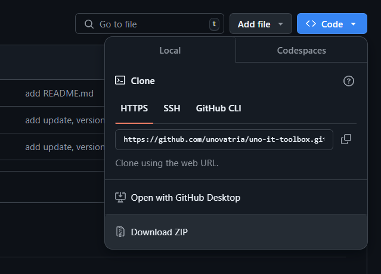
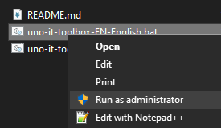
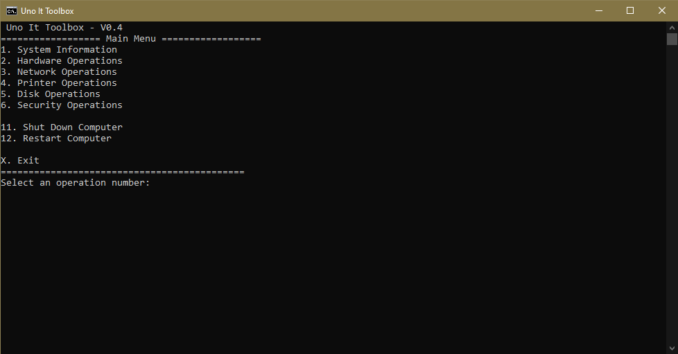
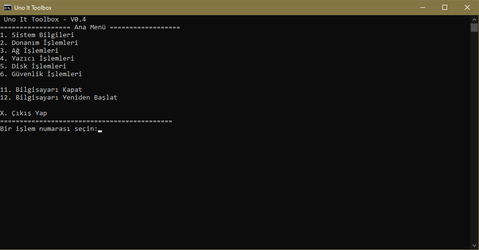

# 🖥️ Uno IT Toolbox

## 📜 Hakkında | About

**Türkçe:**
Uygulama; sistem bilgileri, donanım detayları, ağ ayarları, disk işlemleri ve güvenlik ayarlarına hızlı erişim sağlar. Ayrıca yazıcı işlemleri gibi özelliklerle kullanımı oldukça pratik hale getirir.

**English:**
The application provides quick access to system information, hardware details, network settings, disk operations, and security configurations. It also includes practical features such as printer operations.

---

## 🚀 Kurulum ve Kullanım | Installation & Usage

**Türkçe:**

1. Sağ üstte bulunan **Code > Download ZIP** butonuna tıklayarak arşivi indirin.
2. İndirdiğiniz arşivi bir klasöre çıkarın.
3. Kullanmak istediğiniz dili seçin (`Turkish` veya `English`).
4. **Seçilen dosyayı "Yönetici Olarak Çalıştırın"** ve yönergeleri takip edin.

**English:**

1. Click the **Code > Download ZIP** button at the top right to download the archive.
2. Extract the downloaded archive to a folder.
3. Choose the language you want to use (`Turkish` or `English`).
4. **Run the selected file as "Administrator"** and follow the instructions.

---

## 📂 Özellikler | Features

**Türkçe:**

- **Sistem Bilgileri:** Sistem adı, kullanıcı adı, lisans durumu vb.
- **Donanım İşlemleri:** CPU ve RAM bilgileri.
- **Ağ İşlemleri:** IP adresini görüntüleme, DNS temizleme, ping testi vb.
- **Disk İşlemleri:** Disk durumu kontrolü, geçici dosya temizliği.
- **Güvenlik İşlemleri:** Güvenlik duvarı açma/kapama, BIOS ayarları.
- **Yazıcı İşlemleri:** Yazıcıları listeleme, yazıcı kuyruğunu temizleme.

**English:**

- **System Information:** System name, username, license status, etc.
- **Hardware Operations:** CPU and RAM information.
- **Network Operations:** View IP address, clear DNS cache, ping test, etc.
- **Disk Operations:** Check disk status, clean temporary files.
- **Security Operations:** Enable/disable firewall, BIOS settings.
- **Printer Operations:** List printers, clear printer queue.

---

## 📷 Görseller | Screenshots

Türkçe ve İngilizce versiyonlardan alınmış ekran görüntüleri:**Screenshots from Turkish and English versions:**

- 
- 
- 
- 

---

## 📝 Lisans | License

Bu proje [MIT Lisansı](LICENSE) ile lisanslanmıştır.
This project is licensed under the [MIT License](LICENSE).

